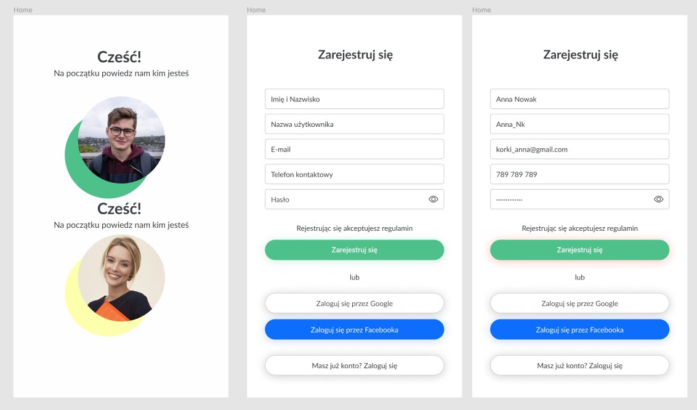
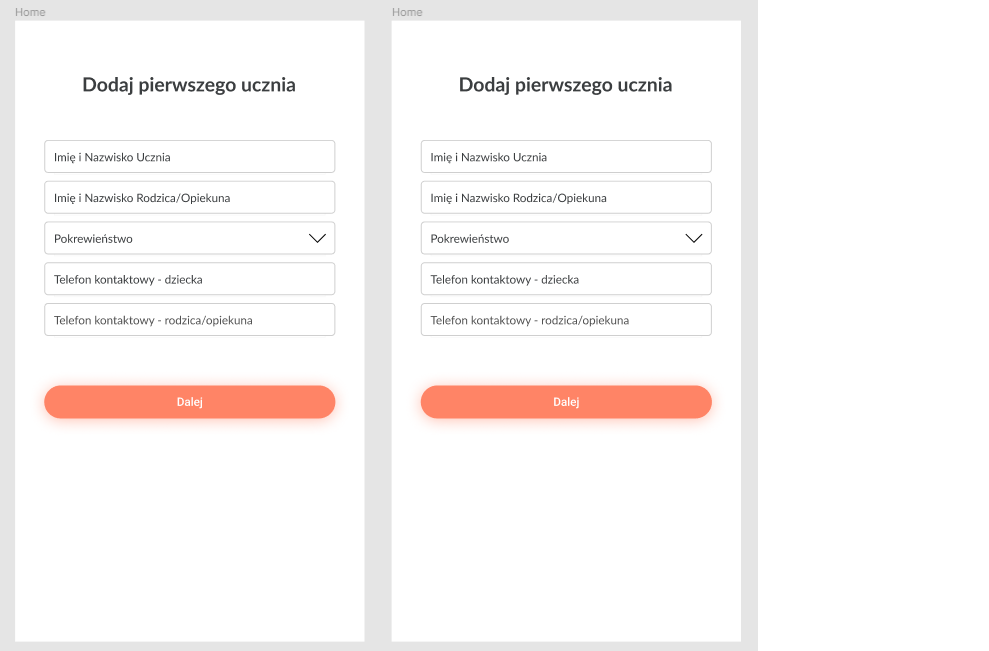

# Coders Camp 2021 (7th ed.) | Team project | TypeScript + NestJs + NextJS

## Team project 

---

### Mentor:

- [Jędrzej Ratajczak](https://github.com/Nilphym)

### Contributors:
#### Backend Team:
- [Krzysztof Gumularz](https://github.com/KrisGum)
- [Przemysław Gajowczyk](https://github.com/Przemyslaw-G)
#### Frontend Team:
- [Marcin Kukułka](https://github.com/MarcinKukulka)
- [Dawid Żłobecki](https://github.com/DawidZlobecki)

## Ukraine Helper 
---
 Projekt42 - is a propotype of an app for teachers which will allow to manage them their individual lessons with students and keep information basic information about them.    

 Prototype and Mockup of the project

[Prototype](https://www.figma.com/file/vJtscwVli3982GtRsOuUGZ/Untitled?node-id=0%3A1)

[Mockup](https://www.figma.com/file/v6HGEfAb25OimFQPhXk9f3/Untitled?node-id=0%3A1)

--
## Demo 

A demo version of the application is not yet available...

---    

## Project idea and main objective 🔍

The purpose of our application is to simplfy the hard work of teachers who teach students individually. Its task is to facilitate the planning of classes and their management of information about our students as well as information about the type of classes, price, etc.
## FrontEnd
Preview of our website:

## BackeEnd
A sneak-peek of our app's server side:

## Used technologies ⚡

And in addition, we also used:

- nodemailer
- luxon
- react router dom
- prettier
- yup
- Redux Toolkit
- GitHub Actions
- Bootstrap
- dotenv
- axios
- envalid

