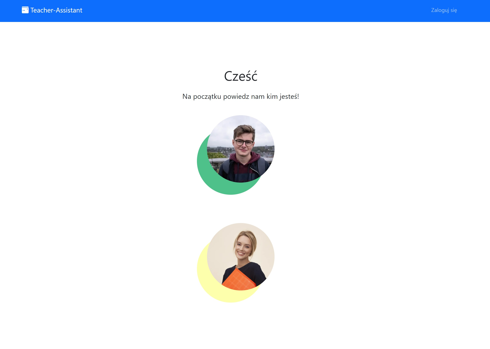
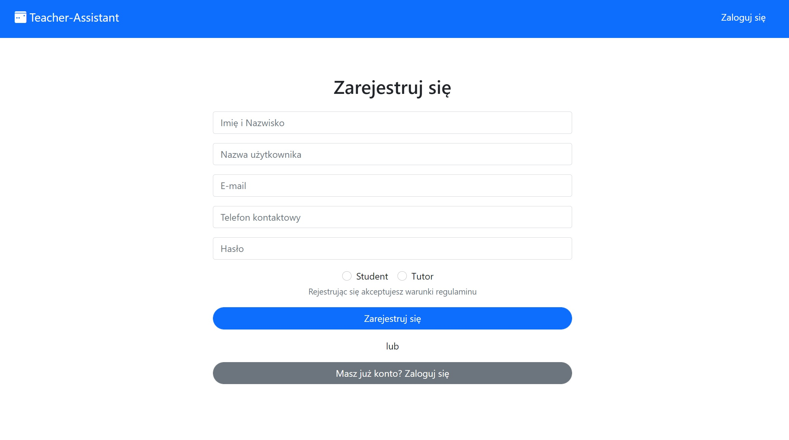
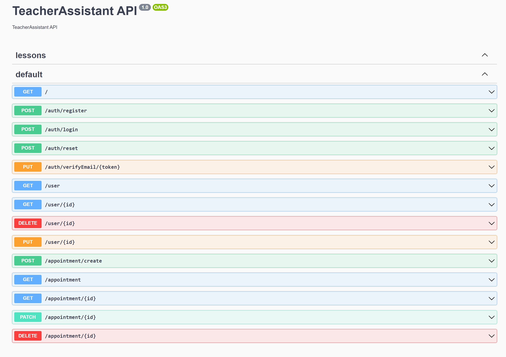

# Coders Camp 2021 (7th ed.) | Team project | TypeScript + NestJS + NextJS

## Team project

---

### Mentor:

- [Jędrzej Ratajczak](https://github.com/Nilphym)

### Contributors:
#### Backend Team:
- [Krzysztof Gumularz](https://github.com/KrisGum)
- [Przemysław Gajowczyk](https://github.com/Przemyslaw-G)
#### Frontend Team:
- [Marcin Kukułka](https://github.com/MarcinKukulka)
- [Dawid Żłobecki](https://github.com/DawidZlobecki)

## TeacherAssistant 
---
TeacherAssistant - is a propotype of an app for teachers which will allow them to manage their individual lessons with students and keep basic information about them.    

---

Prototype and Mockup of the project

[Prototype](https://www.figma.com/file/vJtscwVli3982GtRsOuUGZ/Untitled?node-id=0%3A1)

[Mockup](https://www.figma.com/file/v6HGEfAb25OimFQPhXk9f3/Untitled?node-id=0%3A1)

--

## Demo

A demo version of the application is not yet available...

---

## Project idea and main objective 🔍

The purpose of our application is to simplify the hard work of teachers who teach students individually. Its task is to facilitate the planning of classes as well as managing information about students as well as about the subject of classes, price, etc. In addiction, our app will send email to students about the scheduled classes and show the teacher calendar.
## FrontEnd

Preview of our website:

## BackeEnd

A sneak-peek of our app's server side:

## Used technologies ⚡

## FrontEnd

 

 

 

 
And in addition, in Frontend we also used:
- prettier
- axios
- Redux Toolkit
- yup
 
### BackeEnd
----

 

 
And in addition, in Backend we also used:
- nodemailer
- dotenv
- luxon
- prettier
- express
 
## Others
 

